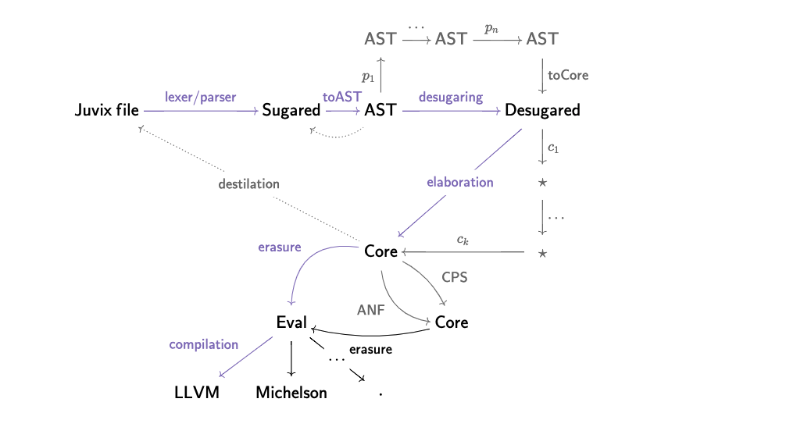

# MiniJuvix

<!-- [](https://github.com/heliaxdev/MiniJuvix/actions) -->
[](LICENSE)

This repository aims to be a conservative Haskell project of a tiny
language with dependent types based on the Juvix project. The primary
purpose is to be a laboratory to study/experiment in implementing a
functional language with dependent types. The following diagram is a
possible design of the compiler. In the picture, syntax
transformations are denoted by p_i (e.g. passes in `Juvix.Translate`)
and checking operations are denoted by c_i (e.g. found in
`Juvix.Core`), and both families of items are the priority of this
project.



The following is a tentative project structure, but it can change at
any moment.

```bash
$ tree src
...
├── src
│   ├── app
│   │   ├── Main.hs
│   │   └── Options.hs
│   ├── MiniJuvix
│   │   ├── Pipeline.hs
│   │   ├── Parser
│   │   ├── Syntax
│   │   │   ├── Sugared.hs
│   │   │   ├── Desugared.hs
│   │   │   ├── Core.hs
│   │   │   └── Eval.hs
│   │   ├── Typing
│   │   │   ├── Scopechecking.hs
│   │   │   ├── Coverage.hs
│   │   │   ├── Typechecking.hs
│   │   │   ├── Termination.hs
│   │   │   └── Erasure.hs
│   │   └── Utils
│   │       ├── Parsing.hs
│   │       ├── Pretty.hs
│   │       ├── File.hs
│   │       └── Version.hs
│   └── test
│       └── Spec.hs
...
```


